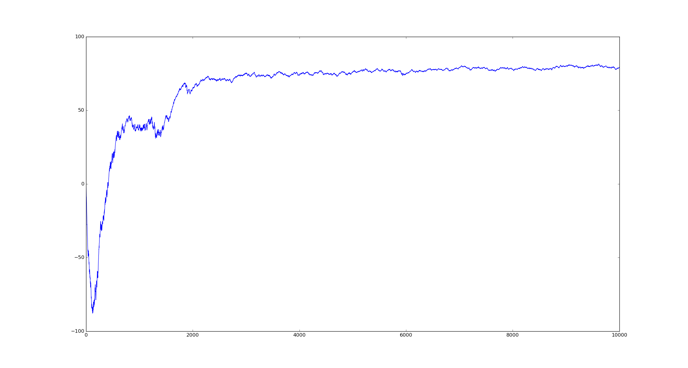
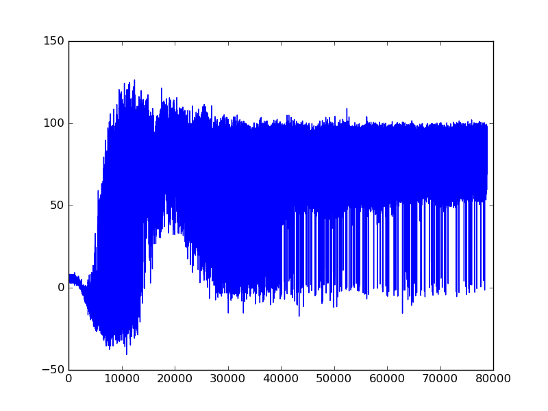
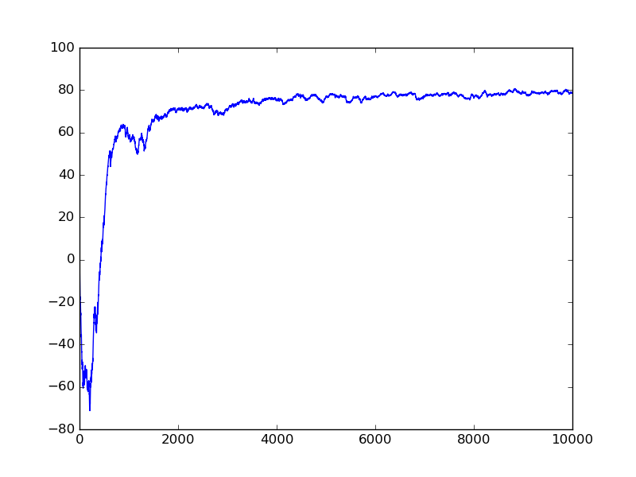
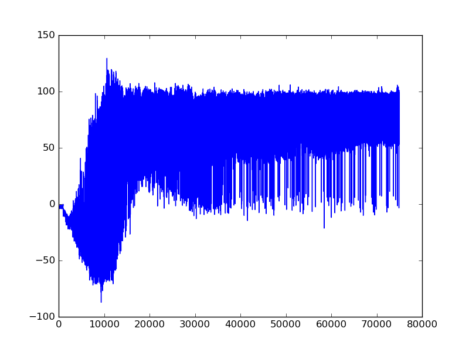

# keras-dqn-doom - Deep Reinforcement Learning in Keras and ViZDoom

Two models were implemented - DQN and Double DQN

## Results

## DQN training process

Average return over 10000 episodes

Mean estimated Q value over 10000 episodes

## DDQN training process

Average return over 10000 episodes

Mean estimated Q value over 10000 episodes

## Author

Itai Caspi
