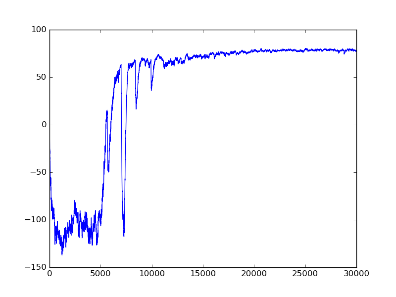
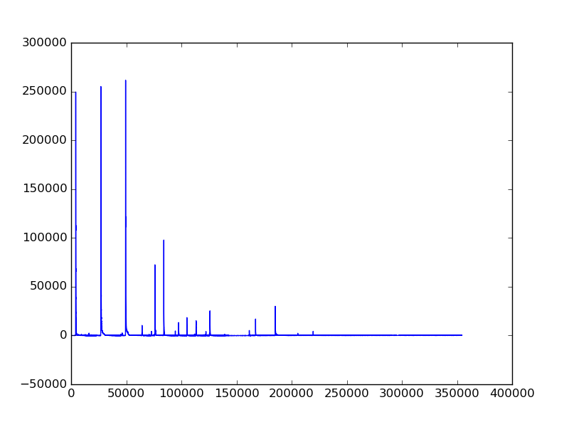

# keras-dqn-doom - Deep Reinforcement Learning in Keras and ViZDoom

## Results

Average return over 10000 episodes

Maximum estimated Q value over 10000 episodes

The hyperparameters and gradient clipping are not implemented as it is as [[4]](#deep-reinforcement-learning-in-tensorflow).

## Author

Itai Caspi
